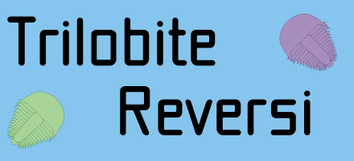
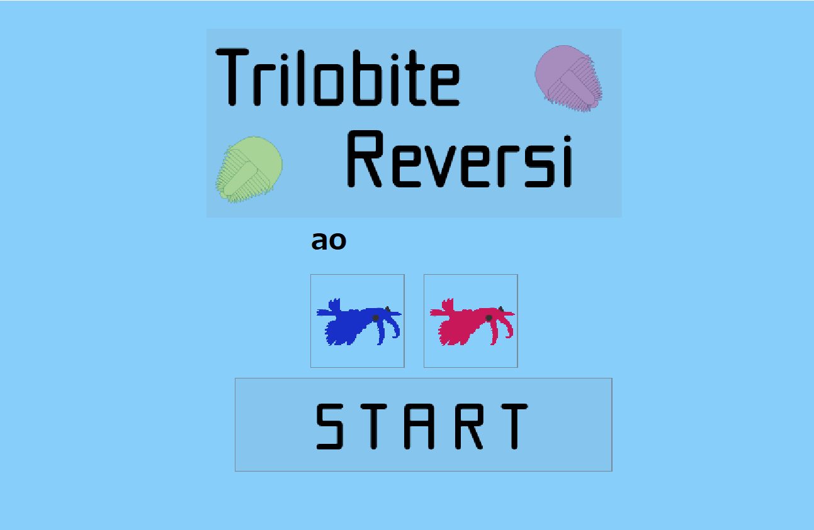
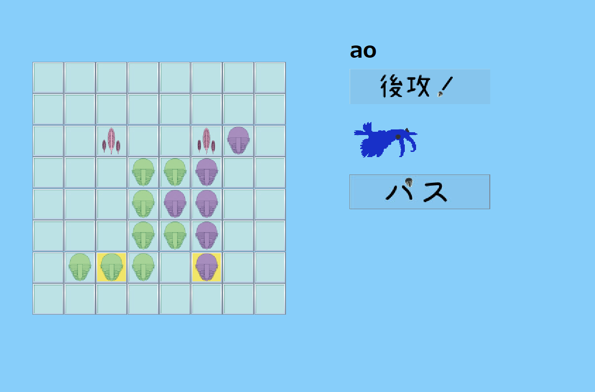
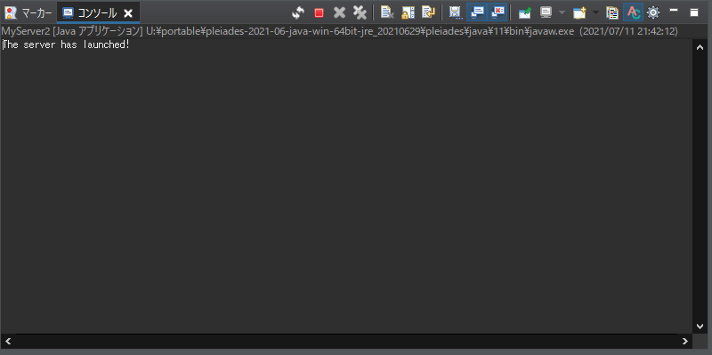
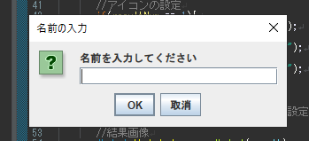
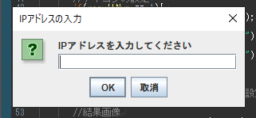

# Trilobite Reversi(JavaReversi)
  
 Trilobite Reversihaは，Javaで制作した対戦型リバーシです．

  

# IMAGES
 

 

# Features

 Trilobite(三葉虫)がコマのリバーシです．基本的なルールは通常のリバーシと同じですが，4つの特別マスを取ると2倍の得点が入ります．

  

# Requirement
 
 Eclipseで実行することを推奨します．
 Eclipseの最新バージョン(2021)での動作を確認しました．
 
 
# Usage
 
 EclipseのワークスペースにTrilobiteReversiを追加して，起動してください．

 起動後は念のためすべてのjavaファイルをコンパイルしてください．

 コンパイル後，始めに"MyServer2.java"を実行してください．実行するとサーバが起動します．

 

 起動後に，"MyClientTop.java"を実行し，名前とipアドレスを入力してください．(他端末と通信して対戦しない場合はipアドレスは入力しないでください).

 

 

 タイトル画面が表示されますので，STARTを押してプレイしてください．
 
# Note
 
 ゲームのデータはTrilobiteRiversiという名のフォルダにすべて入っています．

 このゲームは"MyClientTop.java"，"MyClient.java"，"MyClientResult.java"の順に動きます．必ず"MyClientTop.java"をサーバを起動した後に実行してください．

 ウィンドウの生成は左上で固定されているため，2つ以上のMyClientTopを生成した場合，
 ウィンドウを切り替えを行った場合重なってウィンドウの切り替えが行われます．

 同じPC上でプレイする場合は，"MyClientTop.java"を2度実行してください．

 javaファイルはShift-JISで書かれています．文字化けした場合は文字コードShift-JISにして読み込んでください．
 
# Author
 
 * Ra64i